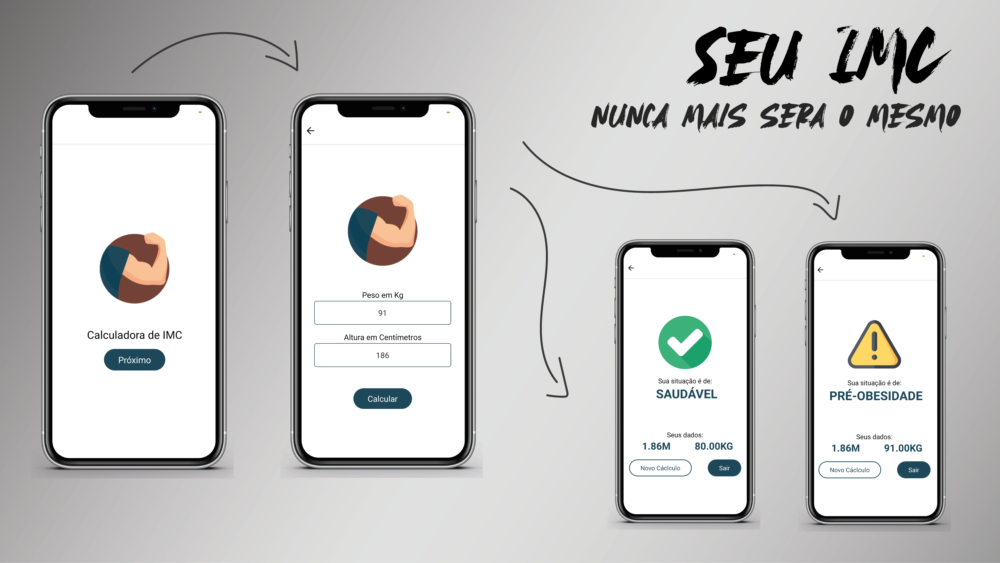

# O que é isso?
Esse projeto é um calculador de IMC simplificado no qual eu pude criar meu primeiro aplicativo via código.

## Como foi usar Vue Native?
O **Vue Native** é um facilitador incrível para quem quer gerar apps a partir de código Vue. 
Em relação ao processo de programação, foi muito simples, as diferenças existem, mas nada de outro mundo. 
Já sobre a instalação do Vue Native, não herda a mesma simplicidade do Vue propriamente dito. 
O deploy desta aplicação foi uma prova de resiliência para mim, *KKKKKKKKK*. A documentação do Vue Native não fala absolutamente nada sobre deploy e, caso você nunca tenha trabalhado com mobile antes, existe uma infinidade de coisas que precisam ser instaladas e importadas para compilar o projeto como um `.apk` ou `.aab`.

## 

#### Exemplos:
- ABD para dispositivos físicos;
- Java Development Kit (PRECISA SER O 15);
- Setar as seguintes variáveis de ambiente (Windows): %PATH%, %JAVA_HOME%, %JRK_HOME%;
- Instalar o expo-cli ou react-native-cli;

## Por que não contribuo com a documentação do Vue Native?
Sou novo no mundo mobile e posso estar cometendo algum equívoco, dessa forma, resguardo-me a apenas contribuir aqui neste repositório.

